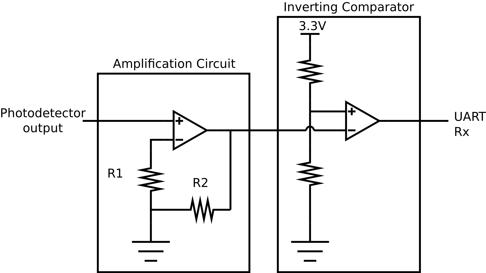

# RPI System Configuration:
To configure the RPI3 Model B, follow the steps below:
- Install the archlinuxarm distribution as described in [this link](https://archlinuxarm.org/platforms/armv8/broadcom/raspberry-pi-3). The 64-bit version is still in development stage and not as stable as the 32-bit version. So, I opted for the 32-bit system.
- After installation, make sure to get the latest system updates by running
```
  # pacman-key --init
  # pacman-key --populate archlinuxarm
  # pacman -Syu
```

## UART on ttyAMA0
- On RPI3, there are two UART ports: the miniUART and the PL011. The miniUART has limited baudrate and smaller buffer size. By default, it is the one connected to linux console output. Meanwhile, the PL011 uart port is used by the bluetooth module. In order to use the PL011 port on GPIO14&15, UART should be enabled and the bluetooth module should be disabled. To do so, the following options are appended in the boot configuration file `/boot/configure.txt`
```
  enable_uart=1
  dtoverlay=pi3-disable-bt
```
- After a reboot, disable the serial console on /dev/ttyAMA0. First, remove `kgdboc=ttyAMA0,115200` and `console=ttyAMA0,115200` from file `/boot/cmdline.txt`.
- Next, stop and disable the `serial-tty` services
```
# systemctl disable serial-getty@ttyAMA0.service
# systemctl stop serial-getty@ttyAMA0.service
```
- Now, the UART port can be used on GPIO 14 (TX) and GPIO 15 (RX). Make sure to connect the RX pin of one RPI to the TX pin of the other RPI.
<p align="center">

</p>
<!--  -->

## Super User Do (sudo)
- So far, the `root` user is used to configure the RPI. However, it is good practice to give the default user "alarm" some permissions and use it instead. To do so, the `sudo` package is required: (create_ap minicom)
```
pacman -S sudo
```
- Edit the visudo file using `Editor=nano visudo` and include the default `alarm` user by adding the line
```
...
##
## User privilege specification
##
root ALL=(ALL) ALL
alarm ALL=(ALL) ALL  ## <=add this line
...
```
- Now, it is very important to change the default password of the `alarm` user using `passwd alarm`.

## Point-to-point protocol (PPP)
The Point-to-Point protocol establishes a TCP/IP communication over UART and is created using the `ppp` package:
```
pacman -S ppp
```
Because the connection is established between two RPIs, this tutorial will refer to them as `RPI_1` and `RPI_2`, where `RPI_1` is the one connected to an Ethernet cable and provides connectivity to `RPI_2` through UART. Initiating a PPP connection comprises two parts. First, the UART parameters are set, namely baud-rate (230400), number of bits and number of parity bits:
```
stty 230400 -F /dev/ttyAMA0 raw
```
Next, the PPP connection is configured by setting the IP addresses and other necessary behavioral options.

On RPI_1, the following command is executed:
```
pppd /dev/ttyAMA0 230400 192.168.1.1:192.168.1.129 proxyarp local noauth debug lock nocrtscts passive persist maxfail 0 holdoff 1
```
On RPI_2, the following command is executed:
```
pppd /dev/ttyAMA0 230400 192.168.1.129:192.168.1.1 noauth local debug lock defaultroute nocrtscts persist maxfail 0 holdoff 1
```
Once the PPP-UART connection is established, a new device called `pppX` shows up in the output of `ip link`. It also prints the sender's and receiver's IP addresses as configured in the two commands above.
After establishing a connection, the `ppp` package heads to the file `/etc/ppp/ip-up` to execute post-connection commands. In our case, `RPI_1` will forward TCP/IP packages on Ethernet to PPP device as follows
```
#!/bin/sh
#
# This script is run by pppd when there's a successful ppp connection.
#

/usr/bin/sysctl -w net.ipv4.conf.ppp0.forwarding=1
/usr/bin/sysctl -w net.ipv4.conf.eth0.forwarding=1
/usr/bin/iptables -t nat -A POSTROUTING -o eth0 -j MASQUERADE
/usr/bin/iptables -A FORWARD -m conntrack --ctstate RELATED,ESTABLISHED -j ACCEPT
/usr/bin/iptables -A FORWARD -i ppp0 -o eth0 -j ACCEPT
/usr/bin/route add -net 192.168.3.128 netmask 255.255.255.128 dev ppp0
```
On the other hand, the `/etc/ppp/ip-up` file on `RPI_2` should be configured as follows
```
#!/bin/sh
#
# This script is run by pppd when there's a successful ppp connection.
#

/usr/bin/iw wlan0 set type __ap
/usr/bin/ip link set up dev wlan0
/usr/bin/ip addr add 192.168.3.129/25 brd + dev wlan0
/usr/bin/route add -net 192.168.3.0 netmask 255.255.255.128 dev ppp0
/usr/bin/sysctl -w net.ipv4.conf.ppp0.forwarding=1
/usr/bin/sysctl -w net.ipv4.conf.wlan0.forwarding=1
```
It creates a WiFi access point using the `wlan0` device and activates TCP/IP forwarding on `wlan0` and `ppp0`.

## Access point
To create and configure a WiFi access point, the following packages are needed
```
pacman -S hostapd dnsmasq
```
The hostapd configuration file is located in `/etc/hostapd/hostapd.conf` and contains
```
interface=wlan0
ssid=RPI_AP_2
driver=nl80211
channel=1
acs_chan_bias=1:0.8 6:0.8 11:0.8
```
Besides, the dnsmasq configuration file is located in `/etc/dnsmasq.conf` and contains
```
domain-needed
bogus-priv
interface=wlan0
dhcp-range=192.168.3.140,192.168.3.200,255.255.255.128,12h
```
To create the access point after establishing the ppp connection, the following to lines are appended in the `/etc/ppp/ip-up` file on `RPI_2`
```
...
/usr/bin/sysctl -w net.ipv4.conf.wlan0.forwarding=1
/usr/bin/dnsmasq
/usr/bin/hostapd -B /etc/hostapd/hostapd.conf
```
## Automatic Start-Up
To automate the above process and execute it automatically at startup, a `systemd` service is created. First, a script file is created in `/usr/bin/my-script` in each RPI and contains:
- On RPI_1
```
stty 230400 -F /dev/ttyAMA0 raw
pppd /dev/ttyAMA0 230400 192.168.1.1:192.168.1.129 proxyarp local noauth debug lock nocrtscts passive persist maxfail 0 holdoff 1
```
- On RPI_2
```
/usr/bin/stty 230400 -F /dev/ttyAMA0 raw
/usr/local/sbin/pppd /dev/ttyAMA0 230400 192.168.1.129:192.168.1.1 noauth local debug lock defaultroute nocrtscts persist maxfail 0 holdoff 1
```
Next, a new systemd unit is created in `/etc/systemd/system/myscript.service` on both RPIs and configured similarly as follows

```
[Unit]
Description=My defined systemd unit

[Service]
Type=oneshot
RemainAfterExit=yes
ExecStart=/usr/bin/bash /usr/bin/my-script

[Install]
WantedBy=multi-user.target
```

Finally, to enable the unit to automatically start during the next boot, the following command is used
```
systemctl enable myscript.service
```
Moreover, to start it instantly, the following command is used
```
systemctl start myscript.service
```
Few other options can be used to either disable, stop or check the status of the script.
```
systemctl disable myscript.service
systemctl stop myscript.service
systemctl status myscript.service
```
## Circuit Design
Concerning the circuit design, the UART pins output 3.3V. On the Tx side, it would be more convenient to increase the transmitted power. Thus, the following setup is employed
<p align="center">

</p>
At the receiver side, the circuit is designed as below. Depending on the distance between the LED and the photo-detector, the received voltage might vary. Thus, in some cases, an additional amplification stage might be necessary.
<p align="center">

</p>
